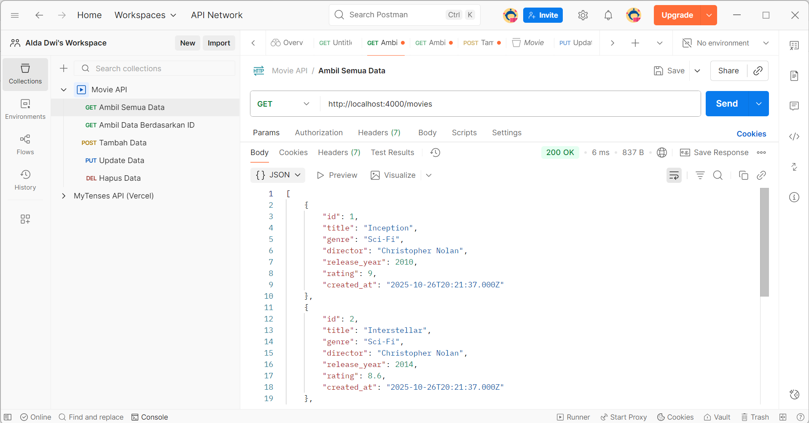
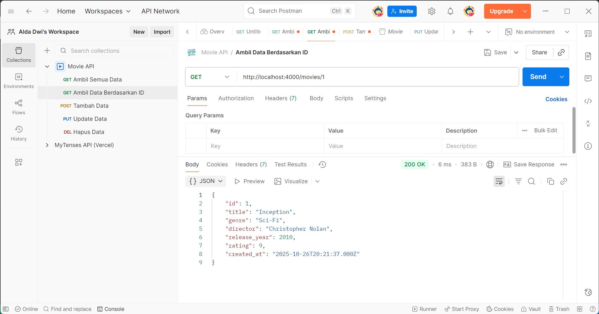
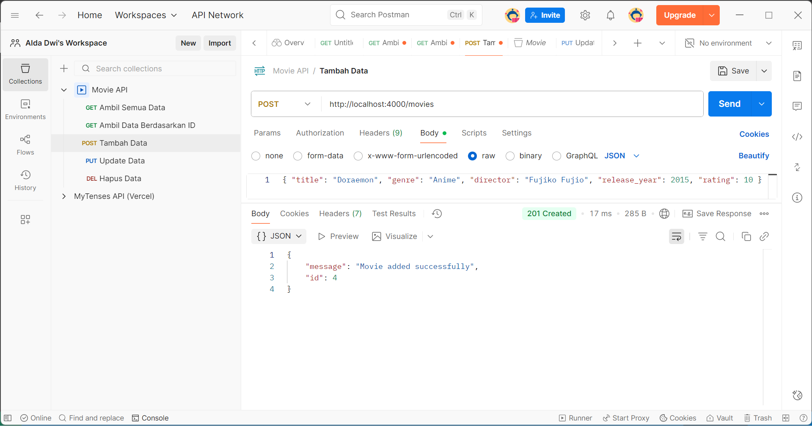
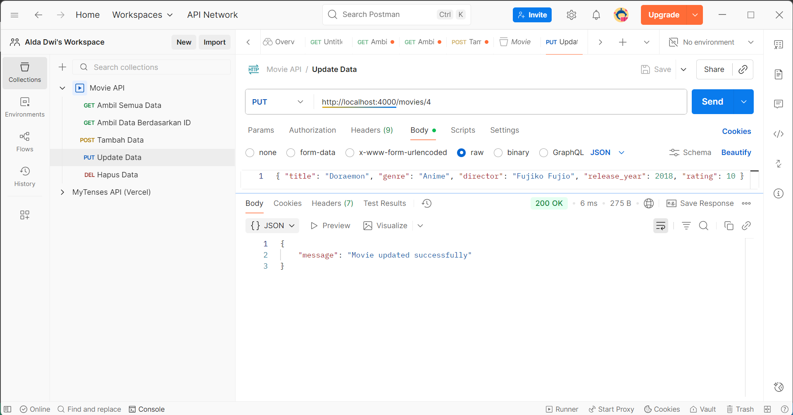
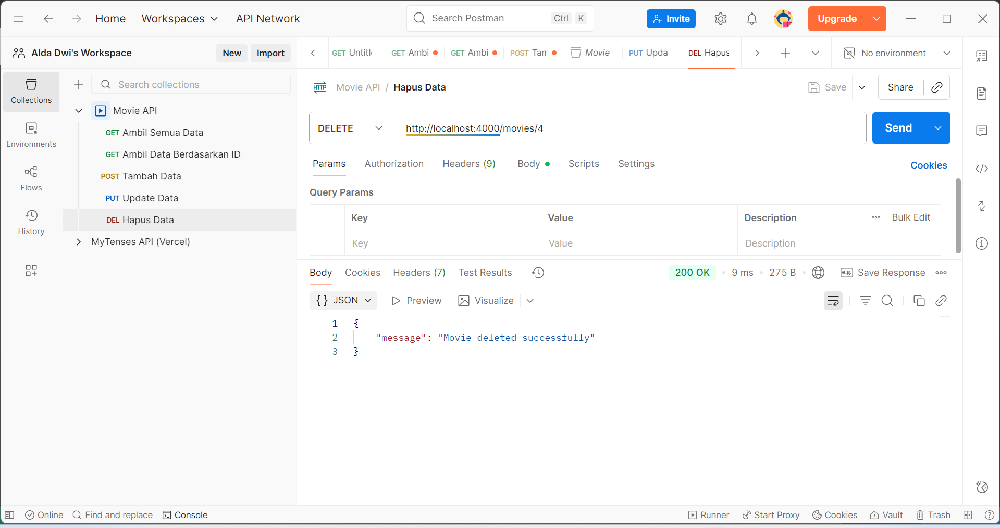

# pwl25-mini-project

- Nama : Alda Dwi Aprisagita
- NIM : F1D022032
- Kelas : Pemrograman WEB Lanjut B

## Deskripsi Tugas

Pembuatan REST API sederhana yang digunakan untuk mengelola data film (Movies API) dengan operasi dasar CRUD (Create, Read, Update, Delete). Aplikasi ini dikembangkan menggunakan Express.js sebagai framework dari Node.js dan MySQL sebagai sistem basis datanya. Struktur kode mengikuti pola MVC (Model–View–Controller) sehingga setiap komponen aplikasi memiliki fungsi yang terpisah dan terorganisir dengan baik.
Selain itu, proyek ini juga menerapkan middleware untuk menambah fungsionalitas seperti pencatatan aktivitas pengguna (logging), validasi data input agar tidak terjadi kesalahan, serta error handling untuk menjaga kestabilan sistem.

## Tujuan

Tujuan dari proyek ini adalah membuat layanan berbasis API (melalui Postman atau aplikasi serupa) untuk melakukan hal-hal berikut:

- Melihat semua data film (GET /movies)
- Melihat detail film berdasarkan ID (GET /movies/:id)
- Menambahkan film baru (POST /movies)
- Memperbarui data film berdasarkan ID (PUT /movies/:id)
- Menghapus data film berdasarkan ID (DELETE /movies/:id)
- Seluruh data disimpan secara persisten di dalam database MySQL sehingga dapat diakses dan dimodifikasi kapan saja.

## Struktur File

- config : Menyimpan konfigurasi koneksi ke database MySQL.
- ncontrollers : Logika menangani permintaan (request) dari endpoint API.
- models : Menyediakan fungsi untuk melakukan interaksi langsung dengan tabel movies pada database.
- routes : Menentukan endpoint API yang digunakan untuk menjalankan operasi CRUD.
- middleware : Berisi fungsi tambahan seperti:
  a. log.js untuk mencatat setiap request yang masuk,
  b. validateMovie.js untuk memvalidasi data input film,
  c. errorHandler.js untuk menangani error secara global.

## Struktur Database

Database yang digunakan bernama movies_db dengan satu tabel utama yaitu movies. Tabel ini menyimpan seluruh data film yang dikelola oleh API. Kolom id berfungsi sebagai primary key dan diatur otomatis meningkat setiap kali data baru ditambahkan. Kolom title, genre, dan director masing-masing digunakan untuk menyimpan judul, jenis film, serta nama sutradara. Kolom release_year mencatat tahun rilis film, sedangkan rating menyimpan nilai penilaian film dalam bentuk angka desimal. Terakhir, kolom created_at mencatat waktu saat data film dimasukkan ke dalam database.

## Alur Kerja

1. Server Dimulai:
   File app.js dijalankan sebagai server utama Express. File ini memuat konfigurasi dari .env, mengatur penggunaan middleware, serta mendefinisikan route utama /movies.

2. Koneksi Database:
   File config/db.js berfungsi untuk menghubungkan aplikasi ke database MySQL dengan bantuan library mysql2. Informasi koneksi seperti host, user, password, dan nama database diatur di dalam file .env.

3. Request Diproses:
   Saat pengguna mengirimkan permintaan HTTP melalui Postman, file routes/movieRoutes.js menentukan endpoint yang dipanggil dan mengarahkan permintaan tersebut ke controller yang sesuai.

4. Logika:
   File controllers/movieController.js berisi logika untuk menangani setiap operasi CRUD. Controller ini memanggil fungsi dari models/movieModel.js untuk menjalankan query SQL yang berhubungan dengan data film.

5. Respons Dikembalikan:
   Setelah proses selesai dijalankan, hasilnya dikirim kembali ke pengguna dalam format JSON yang berisi data film atau pesan status operasi seperti berhasil menambah, memperbarui, atau menghapus data.

## Screenshot Output

1. GET (Mengambil Semua Data)
   

2. GET (Mengambil Data Berdasarkan ID)
   

3. POST (Menambah Data)
   

4. PUT (Update Data)
   

5. DELETE (Menghapus Data)
   
